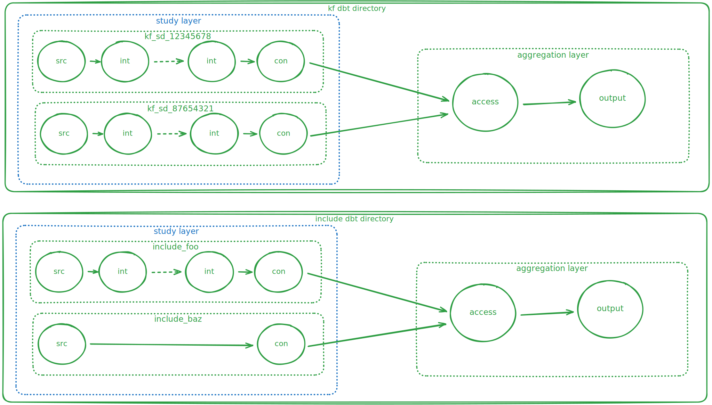

---
# These are optional metadata elements. Feel free to remove any of them.
status: proposed
date: 2025-11-20
---

# DBT Project Structure

## Context

There needs to be cohesive organization of the dbt project that will hold
transformation models for INCLUDE and Kids First program studies. A decision
needs to be made regarding what this structure of the dbt project will take,
particularly in regards to organization of dbt models.

## Decision

The directory tree structure below displays the chosen dbt project organization.

```plaintext
dbt_project/
|-- packages.yml
|-- profiles.yml
|-- dbt_project.yml
|-- .github/
|   |-- PULL_REQUEST_TEMPLATE.md
|   `-- workflows/
|       |-- deployment_workflow.yml
|       `-- linting_workflow.yml
|-- analysis
|-- scripts
|-- snapshots
|-- tests
|-- seeds/
|   |-- _seeds.yml
|   |-- hpo_mapping.csv
|   `-- more_mapping.csv
|-- macros/
|   |-- _macros.yml
|   `-- some_macro.sql
`-- models/
    |-- _access/
    |   |-- _access__models.yml
    |   |-- access_participants.sql
    |   `-- access_specimens.sql
    |-- _export/
    |   |-- fhir/
    |   |   |-- _export_fhir__models.yml
    |   |   |-- exp_fhir_observation.sql
    |   |   `-- exp_fhir_specimen.sql
    |   |-- portal/
    |   |   |-- _export_portal__models.yml
    |   |   `-- exp_portal_participants.sql
    |   `-- reporting/
    |       |-- _export_reporting__models.yml
    |       `-- exp_reporting_diagnoses.sql
    `-- include/
        |-- foo/
        |   |-- _inc_foo__sources.yml
        |   |-- _inc_foo__models.yml
        |   |-- inc_foo_int_abc.sql
        |   |-- inc_foo_int_def.sql
        |   |-- inc_foo_con_participants.sql
        |   `-- inc_foo_con_specimen.sql
        `-- baz/
            |-- _inc_baz__sources.yml
            |-- _inc_baz__models.yml
            |-- inc_baz_int_abc.sql
            |-- inc_baz_int_def.sql
            |-- inc_baz_con_participants.sql
            `-- inc_baz_con_specimen.sql
```

The files and directories in the proposed directory structure are described
below:

* **`packages.yml`** is a configuration file used by dbt for indicating what dbt
  project packages a dbt project uses, such as packages that may be found on dbt
  Hub
* **`profiles.yml`** is a configuration file used by dbt with connection
  in formation for each environment for which the dbt project is deployed
  (e.g prod, qa, and dev). Secrets are stored in environment variables and
  accessed within this file using the `env_var()` macro.
* **`dbt_project.yml`** is a configuration file used by dbt which contains
  important metadata about the dbt project.
* **`analysis`** is a directory used by dbt to hold analysis scripts. These
  scripts are ones that may not necessarily make sense as a model but should
  still be in version control.
* **`seeds`** is a directory used by dbt to hold csv files that dbt loads into
  the warehouse. Seeds are usually mapping files and should not be raw data to
  be loaded or contain sensitive information. These seed files are to be
  documented in a file `_seeds.yml`. The contents of this file are documented
  [here](https://docs.getdbt.com/reference/seed-properties).
* **`macros`** is a directory used by dbt to hold scripts with blocks of code
  that can be re-used multiple times within the project. These macros are to be
  documented in a file `_macros.yml`. The contents of this file are documented
[here](https://docs.getdbt.com/reference/macro-properties).
* **`snapshots`** is a directory used by dbt for defining table snapshots
* **`tests`** is a directory used by dbt for scripts testing multiple tables
  simultaneously.
* **`models`** is a directory used by dbt to hold modeling scripts. The
  contents of this directory are discussed in detail below.

### `models` Organization

The diagram below displays a conceptual layout for the `models` directory:



The models directory will have four subdirectories at its root, one for each
program, INCLUDE and Kids First, one for access models, and one for export
models. The two program directories will each house a directory for each study
within that program.

In the example above, there are two studies in the INCLUDE program, `foo` and
`baz`. Inside of each study directory is:

* `_[program_shortname]_[study_name]__sources.yml`: a file that defines the
  source data for the study
* `_[program_shortname]_[study_name]__models.yml`: a file that defines the
  models for the study.
* `_[program_shortname]_[study_name]_con_[table_name].sql`: The study's
  consensus models. Consensus models take a standardized form such that the
  tables generated by stable models are identical in structure between studies
  and programs. There may be stable models for participants, specimens,
  diagnoses, etc.
* `_[program_shortname]_[study_name]_int_[table_name].sql`: The study's
  internal models. Internal models are for transformations or data curation that
  would otherwise add unnecessary complication to stable models. As such, while
  every study will have stable models, not every study will have internal
  models. Needing internal models depends on the complexity of source data.

Access and export models serve as the unifying layers for multiple studies
within a program. While there is one set of access and export models, they will
be run for both programs using command line arguments. Access models will not
contain transformation of data and will only contain select and join statements
from the appropriate consensus model within each study. Models in the `export`
directory will contain sql models that select from and transform access models.
These export models are for creating datasets for specific users or use cases,
such as transforming data in access models into a format that can be ingested
into a FHIR server. If a program has a need for export model(s) unique to that
program, then an export directory with the appropriate models and yml files
can be placed within that program's directory.
